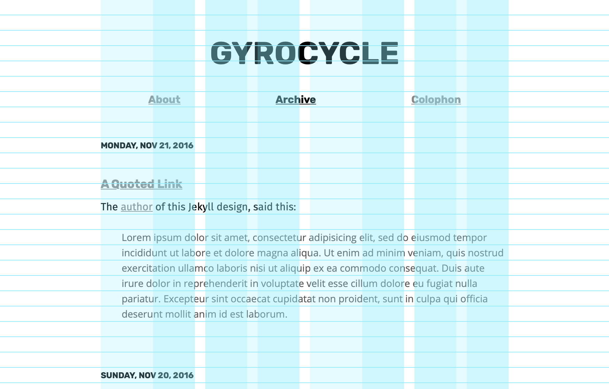

# Gyrocycle

Blog theme for [repla.app](https://repla.app).

It uses [Raster](https://github.com/robenkleene/raster) to construct a layout using typographic grid.

The typefaces are [Rubik][rubik] for headers, [Fira Sans][firasans] for body copy, [Open Sans][opensans] for block quotes, and [Fira Mono][firamono] for code. All of them are free software under the [SIL Open Font License](https://en.wikipedia.org/wiki/SIL_Open_Font_License) or [Apache License](https://www.apache.org/licenses/LICENSE-2.0.html). Thank you for everyone's hard work on free typography.

[rubik]: https://github.com/googlefonts/rubik "Rubik"
[opensans]: https://github.com/google/fonts/ "Open Sans"
[firasans]: https://github.com/mozilla/Fira "Fira Sans"
[firamono]: https://github.com/mozilla/Fira "Fira Mono"




## Raster

To show the raster grid, import the `raster.js` JavaScript in the [HTML `<head>`](_includes/head.html) element:

	<script src="/vendor/raster/dist/js/raster.js"></script>

Add the following classes to the [`<body>` and grid `<div>` elements](_layouts/default.html):

	<body class="raster-show-baseline">
	  <div id="grid" class="raster-show-guidelines">

## Installation

Add this line to your Jekyll site's `Gemfile`:

```ruby
gem "gyroscope"
```

And add this line to your Jekyll site's `_config.yml`:

```yaml
theme: gyroscope
```

And then execute:

    $ bundle

Or install it yourself as:

    $ gem install gyroscope

## License

The theme is available as open source under the terms of the [MIT License](https://opensource.org/licenses/MIT).

